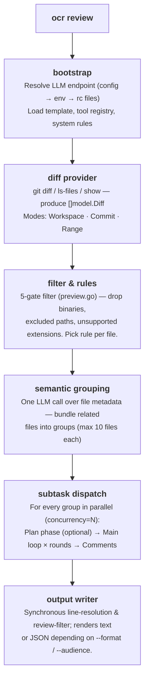
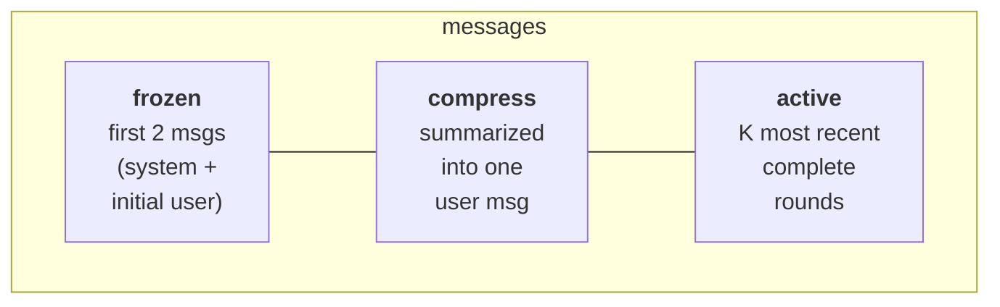

Enter를 누른 순간부터 터미널에 JSON이 찍힐 때까지, `ocr review`가 내부에서
실제로 어떻게 도는지 따라가 봅니다. 동작을 디버깅하고, 플래그를 조절하고,
소스 코드를 자신 있게 읽을 만큼의 머릿속 그림을 만드는 것이 목표입니다.

## 파이프라인 개요 {#high-level-pipeline}



전체 흐름을 지휘하는 코드는
[`internal/agent/`](https://github.com/alibaba/open-code-review/blob/main/internal/agent/)
패키지에 있습니다. 주요 파일은 `agent.go`(디스패치와 그룹별 오케스트레이션),
`grouping.go`(의미 기반 파일 그룹화), `preview.go`(파일 필터),
`util.go`(헬퍼)입니다. 도구 호출 루프와 메모리 압축은 그 옆의
[`internal/llmloop/`](https://github.com/alibaba/open-code-review/blob/main/internal/llmloop/)에
있습니다. 진입점은 두 개가 중요합니다. `Agent.Run`(파이프라인 최상단)과
`Agent.dispatchSubtasks`(그룹별 팬아웃)입니다.

## diff 프로바이더 {#the-diff-provider}

`internal/diff/git.go`가 정의하는 `Provider` 구조체에는 익스포트되지 않은
`mode` 필드(`Mode` 타입, `int` 열거형)가 있습니다. 이 필드가 CLI 플래그와
짝을 이루는 세 가지 모드 중 하나를 고릅니다.

| 모드 | 켜지는 조건 | 반환하는 것 |
|---|---|---|
| `Workspace` | 플래그 없음 | staged + unstaged + untracked 변경 |
| `Commit` | `--commit <sha>` / `-c <sha>` | `<sha>`가 만든 변경(`git show <sha>` 사용, `<sha>^..<sha>` diff와 같음) |
| `Range` | `--from <a> --to <b>` | `merge-base(a, b)..b` |

diff마다 옛/새 경로, 옛/새 hunk, 추가·삭제 줄 수, 바이너리 여부, 이름 변경
감지 결과가 함께 실립니다. `DiffContextLines`는 **3**으로 고정돼 있으며 Git이
쓰는 기본값과 같습니다.

추적되지 않는 파일은 디스크에서 읽어 파일 전체가 추가된 것으로 다룹니다.
그래서 커밋 전에도 리뷰됩니다.

## 다섯 관문 파일 필터 {#the-five-gate-file-filter}

diff를 다 읽고 나면 모든 파일이
[`whyExcluded`](https://github.com/alibaba/open-code-review/blob/main/internal/agent/preview.go)를
지나갑니다. 이 함수는 다음 중 하나를 반환합니다.

```
binary          — file is binary
user_exclude    — matched a pattern in your `exclude` list
unsupported_ext — extension is not in supported_file_types.json
default_path    — matched a built-in test-file exclude pattern
```

파일을 남기기로 했다면 빈 문자열을 반환합니다. `deleted`는 `whyExcluded`가
반환하지 **않습니다**. 남긴 파일의 diff가 `IsDeleted`로 표시되면 그다음에
`Preview()`가 계산합니다. 관문은 이 순서로 돕니다.

1. `binary` — 바이너리 파일을 가장 먼저 버립니다.
2. `user_exclude` — 프로젝트의 `exclude`가 언제나 이깁니다.
3. `user_include` — 필터에 include 패턴이 있고 **그중 하나에** 파일이 걸리면
   그 자리에서 남기고(빈 문자열 반환) 아래의 `unsupported_ext`와
   `default_path` 관문을 건너뜁니다.
4. `unsupported_ext`는 확장자 허용 목록으로 거릅니다.
5. `default_path`가 마지막 관문입니다. 내장 **테스트 파일** 제외 패턴
   (`**/*_test.go`, `**/*.test.{js,jsx,ts,tsx}`, `**/__tests__/**`,
   `**/*_test.py`, `**/*_spec.rb`, `**/*.test.ets` 등)에 걸리는지 봅니다.
   모든 패턴 앞에는 `**/` 접두사가 붙습니다.

잡음이 많은 디렉터리(`vendor/`, `node_modules/`, `target/` 등)는 그보다 앞선
diff 프로바이더 단계에서, `internal/diff/git.go`의 `providerDirIgnoreDirs`
목록으로 걸러 냅니다. 이 디렉터리의 diff는 일단 파싱한 뒤 `filterDiffs`가
떼어 내므로 파일 단위 필터까지 오지 못합니다.

`ocr review --preview`를 돌리면 토큰 한 톨 쓰지 않고 필터 결과 전체를 볼 수
있습니다. 알고리즘 전체는
[리뷰 규칙](../review-rules/#how-files-are-filtered)을 참고하세요.

## 의미 기반 파일 그룹화 {#semantic-file-grouping}

필터를 통과한 파일을 하나씩 따로 리뷰하지는 **않습니다**. 디스패치 전에
[`grouping.go`](https://github.com/alibaba/open-code-review/blob/main/internal/agent/grouping.go)의
`groupDiffs`가 `GROUPING_TASK` LLM 호출을 한 번 합니다. 이때 실어 보내는 것은
파일 *메타데이터* — 경로, 상태(`ADDED` / `MODIFIED` / `DELETED` / `RENAMED`),
추가·삭제 줄 수 — 뿐이고 diff 내용은 절대 보내지 않습니다. 모델은
`{label, files}` 객체의 JSON 배열을 돌려주고, 각 그룹은 대화 하나를 공유하며
리뷰됩니다. 그래야 Agent가 연관된 변경(핸들러 + 서비스 + 테스트, 또는 이름
변경과 그 호출부)을 한데 놓고 따져 볼 수 있습니다.

그룹이 엉뚱해지지 않도록 안전장치가 셋 있습니다.

| 안전장치 | 효과 |
|---|---|
| `maxFilesPerGroup = 10` | 너무 큰 그룹은 파일 10개 단위로 쪼갭니다. |
| 토큰 예산 | 그룹의 diff 합이 프롬프트 상한을 넘으면 파일당 그룹 하나로 되돌립니다. |
| 커버리지 | 모델이 배정하지 못한 파일은 각자 단독 그룹이 됩니다. |

그룹화는 성공을 보장하지 않는 최적화일 뿐 정확성을 좌우하는 관문이
아닙니다. 호출이 실패하거나 응답이 비었거나 파싱되지 않으면 경고를 남기고
파일당 그룹 하나로 디스패치합니다. 예전 동작 그대로입니다. 어떻게 묶였는지는
JSON 출력에도 함께 실립니다.

## 그룹별 서브태스크: plan + main {#per-group-subtask-plan-main}

OCR은 그룹마다 서브 Agent를 하나씩 띄웁니다. 서브 Agent는 각자의 고루틴에서
돌고, `--concurrency`(기본 **8**)로 개수가 제한되며, 저마다 LLM 메시지
버퍼를 따로 씁니다.

서브태스크는 최대 **두 단계**로 이뤄집니다.

### 1단계 — Plan (선택) {#phase-1-plan-optional}

plan 단계를 켤지는 `Template.PlanRequired`가 정하며 임계값 두 개를 함께
봅니다.

```go
// PLAN_MODE_LINE_THRESHOLD = 50, PLAN_MODE_GROUP_LINE_THRESHOLD = 100
if maxFileChanged >= PlanModeLineThreshold           { plan }  // one big rewrite
if fileCount >= 2 && total >= PlanModeGroupLineThreshold { plan }  // several moderate files
```

파일 단위 임계값은 크게 갈아엎은 파일 하나를 잡아내고, 그룹 임계값은 하나하나는
적당해도 합치면 구조적인 안내가 필요해지는 여러 파일을 잡아냅니다. 그룹
임계값을 일부러 더 크게 잡은 것은, 파일이 여럿인 그룹에서 plan 단계가 늘
켜지는 일을 막기 위해서입니다.

작은 변경에서는 plan이 값어치 없이 시간만 잡아먹으므로 조용히 건너뛰고 곧장
main 루프로 갑니다. 그 외에는 `PLAN_TASK` LLM 호출을 **한 번** 합니다. 이때
`Tools` 필드를 보내지 않으므로 모델은 계획 중에 도구를 부를 수 없습니다.
읽기 전용 도구 세 가지(`code_search`, `file_read_diff`, `file_find` —
`tools.json`에서 `plan_task` 플래그가 `true`인 도구들)는 `{{plan_tools}}`
자리에 평문으로 박아 넣어(`formatToolDefs`가 렌더링) 나중에 무엇을 쓸 수
있는지 모델이 알게 합니다. 모델이 돌려준 체크리스트는 main 프롬프트의
`{{plan_guidance}}`가 됩니다.

### 2단계 — main 루프 {#phase-2-main-loop}

main 루프는 `MAIN_TASK` 프롬프트를 조립해 모델과 도구 호출 대화를 진행합니다.
전체 도구 세트에는 plan 단계 도구에 더해 **`task_done`**, **`code_comment`**,
**`file_read`**가 들어갑니다. 전체 목록은 [도구](../tools/)를 참고하세요.

```
loop up to MAX_TOOL_REQUEST_TIMES (default 100):
    response = llm.complete(messages, tools)
    if response.toolCalls is empty:
        nudge model with "You did not successfully call any tools.
                          Please try again or use task_done if finished."
        continue
    for each call: execute → collect result
    if any call was task_done: break
    addNextMessage(...)              # may trigger compression
```

루프를 빠져나가는 조건은 다섯 가지입니다.

1. `task_done`이 호출됐습니다.
2. `MAX_TOOL_REQUEST_TIMES`를 다 썼습니다.
3. 유효한 도구 결과가 없는 라운드가 세 번 이어졌습니다
   (`maxConsecutiveEmptyRounds = 3`).
4. 컨텍스트가 취소됐습니다.
5. `addNextMessage`가 false를 반환했습니다. 압축으로도 메시지 버퍼를 경고
   임계값 아래로 되돌리지 못한 경우입니다.

어느 경우든 그때까지 모인 `code_comment` 호출은 리뷰 코멘트가 됩니다.

### 리뷰 라운드 {#review-rounds}

main 루프는 한 번만 도는 게 아니라 그룹마다 최대 `MAX_REVIEW_ROUNDS`번
돕니다. 큰 그룹에서 놓치는 지적을 줄이기 위해서입니다. 라운드 수는
`--effort` 프리셋이 정합니다.

| `--effort` | 라운드 |
|---|---|
| `low` | 1 |
| `medium`(기본값) | 2 |
| `high` | 3 |

두 번째 라운드부터는 앞선 라운드에서 이미 확정된 지적을
`{{confirmed_comments}}`로 넣어 `MAIN_TASK`를 다시 돌리되, plan은
**빼고** 돌립니다. 뻔한 문제를 한 번 훑고 나면 plan이 오히려 커버리지 천장
노릇을 하기 쉽기 때문입니다. 라운드는 새로 나온 지적이 없거나,
확정 코멘트 상한에 닿았거나, 누적 토큰 예산(`--max-tokens-budget`)이 바닥나면
일찍 멈춥니다.

## 메모리 압축 {#memory-compression}

도구 호출 루프가 길어지면 언젠가는 컨텍스트 윈도가 넘칩니다. OCR은
`MAX_TOKENS = 200000`으로 정의된 프롬프트 예산에 걸려 발동하는 **세 구역
분할** 전략으로 이를 관리합니다.

| 임계값 | 상수 | 동작 |
|---|---|---|
| MAX_TOKENS의 60% | `tokenSoftThreshold` | 백그라운드 압축을 **비동기로** 시작합니다. 지금 돌던 루프는 끊기지 않고 계속됩니다. |
| MAX_TOKENS의 80% | `tokenWarningThreshold` | 다음 요청을 보내기 전에 압축을 **동기로** 돌립니다. |

> **`MAX_TOKENS`는 *입력* 상한입니다.** 프롬프트, 즉 메시지 버퍼를 압축할 때
> 기준이 되는 컨텍스트 윈도 예산만 제한할 뿐 그 밖에는 관여하지 않습니다.
> 모델의 *출력* 상한은 별도의 손잡이인 `MAX_COMPLETION_TOKENS = 16384`이고,
> 매 요청에 `max_completion_tokens`로 실려 갑니다
> (`Template.CompletionTokenLimit()`). 둘을 떼어 놓은 덕분에, 컨텍스트가 큰
> 모델을 쓰려고 `--max-tokens`로 프롬프트 상한을 올려도 출력 예산이 몰래
> 부풀지 않습니다. `MAX_COMPLETION_TOKENS`가 설정돼 있지 않으면 하위 호환을
> 위해 `MAX_TOKENS`를 출력 상한으로 씁니다.

### 세 구역 {#the-three-zones}



여기서 "라운드"란 assistant 메시지 하나와 그 뒤에 따라온 도구 결과 메시지
묶음을 말합니다. `partitionMessages`는 끝에서부터 라운드를 훑으며
`(0.80 × MAX_TOKENS) - reservedTokens` 안에 들어가는 만큼을 남깁니다. 그보다
오래된 것은 모두 **압축 구역**이 됩니다.

압축 구역은 XML로 렌더링해 `MEMORY_COMPRESSION_TASK` 프롬프트와 함께 모델에
보냅니다. 돌아온 요약은 `<previous_review_summary>` 태그에 담겨 원래의 user
메시지 뒤에 붙습니다.

압축이 끝나면 `messages = frozen[2] + compressed_user_msg + active`가 됩니다.

```go
// compression.go
func (a *Agent) runCompression(ctx context.Context, msgs []llm.Message, filePath string) ([]llm.Message, error) {
    part := partitionMessages(msgs, a.args.Template.MaxTokens, 0)
    contextXML := buildMessageXML(msgs[part.frozenEnd:part.compressEnd])
    // … call MEMORY_COMPRESSION_TASK …
    rebuilt[1] = llm.NewTextMessage(role, currentText+
        "\n\n<previous_review_summary>\n"+rawSummary+"\n</previous_review_summary>")
    for i := part.compressEnd; i < len(msgs); i++ {
        rebuilt = append(rebuilt, msgs[i])
    }
    return rebuilt, nil
}
```

### 비동기와 동기 {#async-vs-sync}

비동기 경로에서는 압축이 백그라운드에서 도는 동안 main 루프가 계속 도구를
호출합니다. 다음번 토큰 검사 때 준비된 요약이 있으면
`tryApplyPendingCompression`이 갈아 끼웁니다. 비동기 작업이 끝나기 전에
비율이 경고 임계값을 넘으면 루프를 멈추고 `runCompression`을 동기로 돌립니다.
다음 요청이 반드시 들어맞도록 보장하는 장치입니다.

## 코멘트 처리 파이프라인 {#comment-processing-pipeline}

`code_comment` 도구 호출 하나가 원시 코멘트를 하나 이상 만들어 냅니다. 이
코멘트는 **CommentWorkerPool**(크기가 고정된 고루틴 풀)을 거칩니다. 덕분에
main 도구 호출 루프가 후처리 때문에 멈춰 서는 일이 없습니다.

1. **라인 해석**(워커 안에서) — 슬라이딩 윈도 알고리즘으로 `existing_code`를
   diff와 맞춰 보며 정확한 `start_line` / `end_line`을 계산합니다. 맞추기에
   실패하면 둘 다 `0`이 됩니다. 라인 범위 `0`은 사용자가 직접 위치를 찾아야
   하는 "앵커 없는" 코멘트라는 뜻으로 통합니다(따로 저장하는 플래그는 없고,
   뒷단에서 `start_line == 0`인지 확인합니다).
2. **재배치 작업** *(선택적 대안)* — 만만치 않은 diff에서 라인 해석이
   실패하면 OCR이 `RE_LOCATION_TASK` 프롬프트를 돌려 모델에게 해당 코드
   조각을 다시 짚어 달라고 요청합니다. `existing_code`가 원문 그대로가 아니라
   조금 바꿔 쓰인 경우에 쓸모가 있습니다.
3. **리뷰 필터** — main 루프가 끝나고 워커 풀이 비면 `REVIEW_FILTER_TASK` LLM
   호출로 모인 코멘트를 diff와 대조해 틀렸음이 분명한 것을 걷어 냅니다.
   여기서 나는 오류는 기록만 하고 넘어갑니다.
4. **라인 해석 두 번째 패스** — `Agent.Run`이 반환되고 나면 최상위 명령이
   코멘트 전체를 대상으로 `diff.ResolveLineNumbers`를 다시 돌립니다
   (`cmd/opencodereview/review_cmd.go` 참고). `existing_code`가 여러 파일에
   걸치거나 재배치 단계에서 바뀐 코멘트를 잡아내기 위해서입니다.
5. **렌더링** — `--format`에 따라 텍스트나 JSON으로 출력합니다.

## 토큰 예산 방어선 {#token-budget-guards}

LLM을 부르기도 전에 OCR은 빨리 실패하는 검사를 한 번 합니다.

```go
tokenLimit := MaxTokens * 4 / 5     // 80 %
if countMessagesTokens(messages) > tokenLimit {
    record warning "token_threshold_exceeded"
    return nil      // skip this group
}
```

OCR은 이 검사로 괴물 같은 diff(자동 생성된 lock 파일, 수천 줄을 건드리는
리팩터링)를 요청 비용이 들기 전에 걸러 냅니다. 건너뛴 그룹은 치명적이지 않은
경고로 stdout에 보고되고 JSON `warnings` 배열에도 들어갑니다.

두 번째 검사는 `filterLargeDiffs`에서 돕니다. diff만으로 `MAX_TOKENS`의 80%를
넘으면 그룹화와 디스패치가 시작되기도 전에 걸러 냅니다. 세 번째 방어선은
그룹화 안에 있습니다. 앞의 `enforceGroupTokenBudget`를 참고하세요.

## 템플릿과 플레이스홀더 {#the-template-placeholders}

`internal/config/template/task_template.json`에는 **프롬프트 여섯 개**가
들어 있습니다.

| 키 | 용도 |
|---|---|
| `GROUPING_TASK` | 변경된 파일을 의미 단위 그룹으로 묶습니다. |
| `PLAN_TASK` | 계획 단계. 체크리스트를 만듭니다. |
| `MAIN_TASK` | main 리뷰 루프. `code_comment` 호출을 내보냅니다. |
| `MEMORY_COMPRESSION_TASK` | 압축 구역을 요약합니다. |
| `REVIEW_FILTER_TASK` | 루프가 끝난 뒤 틀렸음이 분명한 코멘트를 걷어 냅니다. |
| `RE_LOCATION_TASK` | `existing_code`를 맞추지 못한 코멘트의 위치를 다시 짚습니다. |

프롬프트는 저마다 `{role, prompt_file}` 참조 목록이고, 이 참조는 템플릿
디렉터리의 `.md` 파일을 가리킵니다(예:
`{"role": "system", "prompt_file": "main_task_system.md"}`). 로드 시점에
`resolveConversation`이 그 파일들을 읽어 메모리상의 `{role, content}` 메시지로
만들고, 이어서 템플릿 플레이스홀더를 그룹마다 채웁니다.

| 플레이스홀더 | 치환되는 내용 |
|---|---|
| `{{system_rule}}` | 4계층 체인에서 해석한 규칙 본문을 그룹의 파일 전체에 걸쳐 합친 것. |
| `{{change_files}}` | 이 그룹 *바깥*에 있는 PR의 변경 파일 전체의 상태와 경로. |
| `{{diffs}}` | 그룹의 diff. 파일 하나당 XML 요소 하나. |
| `{{plan_guidance}}` | plan 단계의 출력. plan을 건너뛰었거나 2라운드 이후면 제거됩니다. |
| `{{confirmed_comments}}` | 앞선 리뷰 라운드에서 확정된 지적(1라운드에서는 비어 있음). |
| `{{plan_tools}}` | plan 단계 도구 정의를 평문으로 렌더링한 것(`formatToolDefs`). `PLAN_TASK` 시스템 프롬프트에 쓰입니다. |
| `{{requirement_background}}` | `--background` 또는 `--background-file`로 정해진 실제 배경(파일 쪽이 우선). |
| `{{current_system_date_time}}` | 실행 시각의 로컬 타임스탬프. `YYYY-MM-DD HH:MM` 형식(초·시간대 없음). |
| `{{file_list}}` | (그룹화 전용) 파일 메타데이터 — 경로, 상태, `+/-` 줄 수. |
| `{{context}}` | (압축 전용) 요약할 메시지를 XML로 렌더링한 것. |
| `{{path}}` | 그룹 키(정렬된 경로를 쉼표로 이은 것). `REVIEW_FILTER_TASK`에 쓰입니다. |
| `{{comments}}` | 그때까지 모인 코멘트(JSON). `REVIEW_FILTER_TASK`에 쓰입니다. |

플레이스홀더 치환 코드는
[`agent.go`](https://github.com/alibaba/open-code-review/blob/main/internal/agent/agent.go)에
있습니다. 템플릿 자체는 CLI로 덮어쓸 수 없습니다. 프롬프트를 바꾸려면
[`task_template.json`](https://github.com/alibaba/open-code-review/blob/main/internal/config/template/task_template.json)을
고치고 다시 빌드해야 합니다. `--tools` 플래그는 *도구 레지스트리*를 덮어쓰는
것이지(`internal/config/toolsconfig`가 읽는 JSON을 갈아 끼웁니다) 템플릿을
덮어쓰는 게 아닙니다. [도구](../tools/#customizing-tools)를 참고하세요.

> **플레이스홀더 문법 주의.** 위의 플레이스홀더는 모두 중괄호 두 개
> `{{…}}` 문법을 쓰지만 `RE_LOCATION_TASK`만 예외입니다. 여기서는 중괄호
> 하나짜리 `{diff}`, `{existing_code}`, `{suggestion_content}`를 치환합니다
> (`internal/diff/relocation.go` 참고).

## 저장 {#persistence}

모든 리뷰는 JSONL로 디스크에 기록됩니다.

```
~/.opencodereview/sessions/<encoded-repo-path>/<session-id>.jsonl
```

저장소 경로는 base64로 인코딩하지 **않습니다**.
`encodeRepoPath`(`internal/session/persist.go`)가 `/`와 `\`를 `-`로, `:`를
`_`로 바꿔 파일 시스템에서 안전한 경로로 만듭니다.

한 줄이 이벤트 하나입니다. 보낸 프롬프트, LLM 응답, 도구 호출, 도구 결과,
내보낸 코멘트 등입니다. 웹 UI(`ocr viewer`)는 이 파일을 그대로 읽습니다.
데이터베이스는 없고 덧붙이기만 하는 로그뿐입니다. UI 둘러보기와 이벤트
스키마는 [세션 뷰어](../viewer/)를 참고하세요.

## 텔레메트리 {#telemetry}

텔레메트리를 켜면 Agent는 파이프라인 수준의 스팬 세 종류를 내보냅니다. 작업
전체를 감싸는 `review.run`, diff 로딩을 감싸는 `diff.parse`, 그리고 리뷰한
그룹마다 하나씩 생기는 `subtask.execute.group.<group-key>`입니다. 여기에 결정
지점마다 짧게 생겼다 사라지는 `event.<name>` 스팬(`plan.skipped`,
`token.threshold.exceeded`, `subtask.error` 등)이 더해집니다. LLM 왕복과 도구
호출은 스팬이 아니라 메트릭으로만 기록됩니다. 프롬프트와 응답 내용은
텔레메트리에 **절대** 실리지 않습니다. `OCR_CONTENT_LOGGING` 플래그는 배선만 돼
있고 지금은 동작하지 않습니다. 전체 스키마는
[텔레메트리](../telemetry/)를 참고하세요.

## 자동화하지 *않은* 것 {#what-s-not-automated}

일부러 사람 손에 남겨 둔 결정이 몇 가지 있습니다.

- **엔드포인트 탐색에는 대안이 없습니다.** 설정과 환경 변수, rc 파일을 다
  뒤져도 `(URL, token, model)` 세 값이 완전히 채워지지 않으면 OCR은 넘겨짚지
  않고 0이 아닌 코드로 종료합니다.
- **서브 Agent 실패는 격리할 뿐 재시도하지 않습니다.** 그룹 하나가 실패하면
  경고를 남기고 나머지는 계속 갑니다. 재시도는 Agent가 아니라 그것을 감싸는
  CI 파이프라인이 할 일입니다.
- **파일을 넘나드는 추론은 그룹 안으로 한정됩니다.** 같은 의미 그룹의 파일은
  LLM 대화 하나를 공유하므로 Agent가 그 사이를 직접 오가며 따져 볼 수
  있습니다. *다른* 그룹의 파일은 컨텍스트 공유가 아니라 `file_read_diff` /
  `code_search` 도구 호출로만 닿을 수 있고, 거기서 발견한 문제는 코멘트 대상이
  될 수 없습니다. `main_task` 프롬프트가 컨텍스트 도구는 이해에만 쓰고
  주어진 diff 바깥에서 드러난 문제는 무시하라고 모델에 지시합니다.

이런 선택 덕분에 실행은 **그룹 단위로 결정적**이고 비용도 예측 가능하게
유지됩니다.

## 소스 코드 지도 {#source-code-map}

코드를 같이 펼쳐 놓고 읽고 싶다면 참고하세요.

| 관심사 | 파일 |
|---|---|
| 최상위 명령 디스패치 | `cmd/opencodereview/main.go` |
| `review` 플래그 파싱 | `cmd/opencodereview/shared_flags.go` |
| Agent 오케스트레이션 | `internal/agent/`(agent.go, util.go) |
| 의미 기반 파일 그룹화 | `internal/agent/grouping.go` |
| 도구 호출 루프와 메모리 압축 | `internal/llmloop/`(loop.go, compression.go) |
| effort 프리셋 | `internal/config/template/effort.go` |
| 파일 필터 / 미리 보기 | `internal/agent/preview.go` |
| diff 로딩(Git 모드) | `internal/diff/git.go` |
| 규칙 해석 체인 | `internal/config/rules/system_rules.go` |
| 도구 레지스트리와 구현 | `internal/tool/` |
| LLM 엔드포인트 해석기 | `internal/llm/resolver.go` |
| 세션 JSONL 기록기 | `internal/session/persist.go` |
| 웹 뷰어 | `internal/viewer/server.go` |

빌드와 테스트 방법은 [기여하기](../contributing/)를 참고하세요.

## 함께 보기 {#see-also}

- [도구](../tools/) — Agent 루프가 호출하는 도구 여섯 가지.
- [리뷰 규칙](../review-rules/) — 파일별 규칙 텍스트가 어떻게 정해지는지.
- [세션 뷰어](../viewer/) — 이 파이프라인이 남기는 기록을 들여다보기.
